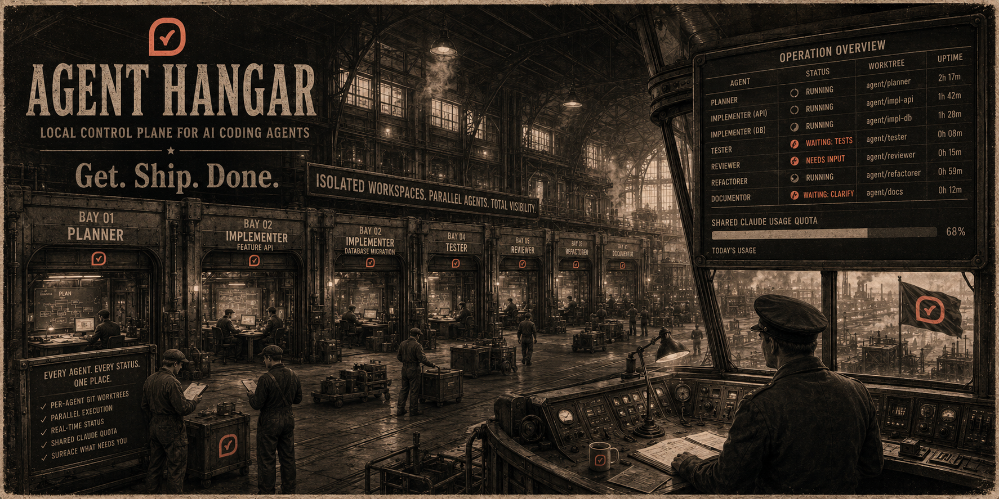

# Agent Hangar



Agent Hangar is a local control plane for running parallel AI coding agents in tmux. It spawns isolated workspaces with git worktrees, generates the agent instructions, and surfaces every agent's status — including shared Claude usage quota — so you can see at a glance which agents need attention without flipping between terminal windows.

The hangar metaphor: each agent gets its own bay (a workspace), prepared the same way every time, and a control tower (the cockpit) shows what's where. You stay in the tower; you walk to a bay only when something needs you.

## Why this exists

When you run several AI agents in parallel across multiple repositories, two things break down:

1. **You become the bottleneck.** Agents block on validation, clarification, or access requests. You don't notice fast enough because you're heads-down in your own work. The dashboard surfaces those moments in your peripheral vision.
2. **Repository state contaminates.** Refinement, planning, and review agents get confused by dirty working trees that other agents are actively changing. Per-agent git worktrees fix this.

Agent Hangar solves both with shell-light, file-based primitives: status files on disk, git worktrees per agent, tmux windows for switching, and a Python orchestration layer that ties it together.

## Core concept

One **slug** identifies one **workspace**. A workspace has:

- one tmux window (named after the slug)
- one status entry under `~/.agent-control/status/<slug>.status`
- one generated `AGENTS.md` (Claude reads it as `CLAUDE.md` via a symlink)
- one `.agent/` metadata directory (no `prompt.md` — the agent CLI opens to an empty conversation; your first message is the task)
- zero or more git worktrees under the workspace directory, each on a branch you name at spawn time

A workspace can have **zero** worktrees (useful for planning or PRD agents that don't need code), **one** worktree (single-repo tasks — the common case), or **many** (cross-repo features). Repository selection is per-spawn, deliberately not pre-checked.

```text
~/agent-work/permissions-refactor/
├── AGENTS.md
├── CLAUDE.md -> AGENTS.md
├── .agent/
│   ├── metadata.env
│   ├── status -> ~/.agent-control/status/permissions-refactor.status
│   └── HANDOFF.md
├── backend-core-nestjs/    # git worktree on the branch you supplied at spawn time
└── frontend-hotelkit-web/  # git worktree on the same branch (same name across all repos)
```

## Supported environments

The hangar targets **Linux or WSL**. macOS works for development; the v1 test-user target is Windows 11 + WSL2 with Debian. The setup below walks through that path step by step.

You need on your machine (or inside your WSL distro):

- `git`, `tmux`, `bash`
- Python 3.11+
- `watch` (in the `procps` package on Debian/Ubuntu — usually preinstalled, but the cockpit pane needs it)
- An agent CLI on `PATH` (Claude Code is the default; the command name is configurable via `AGENT_COMMAND`)

# Setup on Windows 11 (WSL2 + Debian)

This is the test-user happy path. If you already have a working WSL Debian, jump straight to **Step 3**.

### Step 1 — Install WSL2 with Debian

Open **PowerShell as Administrator** and run:

```powershell
wsl --install -d Debian
```

Reboot if Windows asks. After the reboot, the Debian shell opens automatically and asks for a UNIX username + password — those are your WSL credentials, not your Windows credentials.

From now on, every command in this guide runs **inside WSL**. Open Windows Terminal and pick the `Debian` profile (or run `wsl -d Debian` from PowerShell).

> Already on a different WSL distro? `wsl --list --verbose` to check; `wsl --set-default Debian` to make Debian the default. The instructions also work on WSL Ubuntu — the apt packages are the same.

### Step 2 — Make the Windows Terminal bell audible

The hangar rings the terminal bell when an agent transitions to `BLOCKED`. Windows Terminal silences the bell by default, so you'll miss it without this:

1. Open Windows Terminal → **Settings** → **Profiles → Defaults → Advanced**.
2. **Bell notification style** → tick `Audible` (and optionally `Window` to flash the title bar too).
3. Save.

Test it once everything is installed with `printf '\a'` inside WSL — you should hear a ding.

### Step 3 — Install the prerequisites

Inside your WSL Debian shell:

```bash
sudo apt update
sudo apt install -y git tmux python3 python3-pip python3-venv pipx procps
pipx ensurepath
```

Open a **new** WSL shell after `pipx ensurepath` so `~/.local/bin/` lands on your `PATH`. Confirm:

```bash
which tmux python3 pipx watch
# all four should print a path; none should be silent
```

### Step 4 — Install an agent CLI

The hangar drives whichever CLI you have on `PATH` (`claude` by default, override with `AGENT_COMMAND`). For Claude Code:

```bash
curl -fsSL https://claude.ai/install.sh | bash
```

…or install via npm if you prefer:

```bash
npm i -g @anthropic-ai/claude-code
```

Then run `claude` once to log in. The login flow is browser-based; WSL will open your Windows browser automatically.

### Step 5 — Clone and install Agent Hangar

```bash
cd ~
git clone <repo-url> coding-agent-hangar
cd coding-agent-hangar
pipx install .
```

If `pipx install .` complains about a missing `pip` or `setuptools`, fall back to:

```bash
pip install --user -e .
```

Either path puts the `hangar-*` and `agent-*` console scripts on your `PATH`. Confirm:

```bash
hangar-setup --help
agent-spawn --help
```

### Step 6 — First-time setup

```bash
hangar-setup
```

This creates `~/.agent-control/` and seeds `~/.agent-control/config/repos.yaml` from the bundled sample. Edit that file to list your real repositories — see [Configure your repos](#configure-your-repos) below.

Re-running `hangar-setup` is idempotent: it adds any missing subdirs and never clobbers an existing `repos.yaml`.

### Step 7 — Sanity-check the cockpit

```bash
hangar-checkin
```

This creates the `agents` tmux session, opens the `cockpit` window with `hangar-watch` running under `watch -n 2`, and attaches you. You should see an empty grouped dashboard (no workspaces yet). Press `Ctrl-b d` to detach from tmux.

You're ready to spawn agents.

## Configure your repos

Open `~/.agent-control/config/repos.yaml`:

```yaml
repos:
  - key: backend
    name: backend-core-nestjs
    path: /var/www/backend-core-nestjs
    default: true          # sort hint only; NOT pre-checked
    bootstrap: npm ci
    base_branch: origin/main

  - key: frontend
    name: frontend-hotelkit-web
    path: /var/www/frontend-hotelkit-web
    default: true
    bootstrap: npm ci

  - key: mobile
    name: hotelkit-react-native
    path: /var/www/hotelkit-react-native
    bootstrap: npm ci

  - key: e2e
    name: playwright-e2e-tests
    path: /var/www/playwright-e2e-tests
    bootstrap: npm ci
```

Fields:

| Field | Required | Notes |
|---|---|---|
| `key` | yes | Short identifier you'll type at the CLI (e.g. `agent-spawn fix backend frontend ...`). |
| `name` | yes | Directory name under the workspace. Pick something filesystem-friendly — usually the canonical repo's dir name. |
| `path` | yes | Absolute path to the canonical git repo. WSL paths (`/var/www/...`, `/home/<you>/...`) — **not** Windows paths like `C:\`. The hangar runs `git -C <path> worktree add` against this. |
| `default` | no | `true` sorts this repo to the top of the interactive picker. Not pre-selected. |
| `bootstrap` | no | Shell command run inside each new worktree right after creation. Stdout/stderr go to `~/.agent-control/logs/<slug>-<repo>-bootstrap.log`. Examples: `npm ci`, `pnpm install --frozen-lockfile`, `composer install`. Leave empty if no install step is needed. |
| `base_branch` | no | Branch that `git worktree add` branches off of. Defaults to `origin/main`. |

> If your dev environment runs in containers (e.g. `docker compose exec backend php artisan ...`), the hangar doesn't care — it only talks to the canonical repo on disk. The `bootstrap:` command runs on the host (WSL) side, so use a host-side install command, not one that has to go through `docker exec`. If `npm ci` lives inside a container, leave `bootstrap` empty and let the agent run it from inside its session.

### Environment variables (all optional)

```bash
# Override any of these in ~/.bashrc / ~/.zshrc; defaults shown.
export AGENT_CONTROL_HOME="$HOME/.agent-control"
export AGENT_WORK_HOME="$HOME/agent-work"
export AGENT_TMUX_SESSION="agents"
export AGENT_BASE_BRANCH="origin/main"
export AGENT_COMMAND="claude"
export AGENT_STALE_MINUTES="30"
```

If you want workspaces under `/var/www/agent-work/` (for nginx wildcard vhosts), set `AGENT_WORK_HOME=/var/www/agent-work`.

## Daily workflow

```bash
# Open the cockpit (creates / attaches the `agents` tmux session)
hangar-checkin

# Spawn an interactive workspace — prompts for slug, repos, branch
agent-spawn

# Or spawn non-interactively
agent-spawn permissions-refactor backend frontend --branch feature/perms

# Inside the agent's tmux window the `claude` command is pre-typed; press Enter
# to launch the agent, then type the task as your first message.
```

From inside the agent's session, the agent updates its own status:

```bash
agent-status permissions-refactor WORKING "Inspecting permission checks in backend"
agent-mark-as-blocked permissions-refactor "Should missing access return 403 or 404?"
agent-mark-done permissions-refactor "Refactored guards; PR opened at #1234"
```

From the cockpit (or anywhere with the `agent-*` scripts on `PATH`):

```bash
agent-jump permissions-refactor       # focus that workspace's tmux window
agent-jump blocked                    # jump to the next blocked agent (or pick from a list)
agent-jump feedback                   # same, for NEEDS_FEEDBACK
agent-list                            # plain table of every workspace
hangar-watch                          # one-shot dashboard render
```

When a task is done and the PR is merged:

```bash
agent-teardown permissions-refactor   # guided checklist; irreversible
```

The teardown command prints the state of every worktree (branch, dirty flag, whether it's merged into the base branch) and walks you through removing each worktree, deleting each branch, and archiving the status file. It refuses to proceed if a worktree has uncommitted changes unless you pass `--force`.

## Existing-slug handling

When you run `agent-spawn <existing-slug>` non-interactively, the hangar refuses to clobber the existing workspace. You have three options:

```bash
agent-spawn alpha --resume                                  # reattach to the existing workspace
agent-spawn alpha backend --branch feature/v2 --suffix      # create alpha-2 with these repos+branch
agent-spawn alpha backend --branch feature/x                # still errors (default behavior)
```

Interactive mode (`agent-spawn` with no positional slug) presents the same three choices as a `[r]esume / [s]uffix / [a]bort` prompt.

## Commands

Commands split by domain. `agent-*` commands deal with agents themselves — one or many. `hangar-*` commands deal with hangar infrastructure: setup, monitoring stations, plumbing.

**Hangar infrastructure**

| Command               | Purpose                                                                                                                                            |
| --------------------- | -------------------------------------------------------------------------------------------------------------------------------------------------- |
| `hangar-setup`        | One-time bootstrap. Create `~/.agent-control/` layout and seed `repos.yaml` from the bundled hotelkit sample.                                      |
| `hangar-checkin`      | Open the cockpit window. Create or attach the `agents` tmux session, create or reuse the `cockpit` window with the watched dashboard inside.        |
| `hangar-watch`        | The rich dashboard render — grouped statuses, quota pane, colors. What `hangar-checkin`'s `watch -n 2` loop calls. Also runnable one-shot.         |
| `hangar-statusline`   | Emit the compact `[B:n] [F:n] [R:n] [W:n] \| 5h:U%/E% 7d:U%/E%` line consumed by `set -g status-right` in `~/.tmux.conf`. Wired once; not typed.   |
| `hangar-quota-update` | Plumbing: read Claude statusline JSON from stdin, normalize, write `~/.agent-control/quotas/claude.json`. Wired into the Claude statusline; not typed. |

**Agents**

| Command                                 | Purpose                                                                                                                                  |
| --------------------------------------- | ---------------------------------------------------------------------------------------------------------------------------------------- |
| `agent-spawn [slug] [repo...]`          | Create a workspace. Interactive when args omitted; prompts resume/suffix/abort if slug exists. Pass zero repos for a planning workspace. |
| `agent-status <slug> <state> <summary>` | Update one workspace's status file. Atomic write.                                                                                        |
| `agent-mark-as-blocked <slug> <message>`| Set state to `BLOCKED`, send tmux display-message, ring the bell.                                                                        |
| `agent-mark-done <slug> <summary>`      | Set state to `DONE`, send tmux display-message, ring the bell. Does **not** touch worktrees or branches.                                 |
| `agent-list`                            | Plain ASCII table of every agent and its state. The simple, scriptable view used outside the cockpit.                                    |
| `agent-jump <slug\|blocked\|feedback>`  | Switch tmux to an agent's workspace; with `blocked`/`feedback` picks the next match (interactive picker on multi-match).                 |
| `agent-teardown <slug>`                 | Guided interactive teardown of one agent's workspace (worktrees, branches, archive). Irreversible. Refuses uncommitted work without `--force`. |

## Status states

```text
STARTING         workspace created, bootstrap running
WORKING          agent is actively working
NEEDS_FEEDBACK   agent needs a decision but is not fully blocked
BLOCKED          agent cannot proceed without input/access
READY            agent believes the task is ready for review
DONE             agent finished
FAILED           agent hit an unrecoverable issue
PAUSED           workspace intentionally paused
STARTING_FAILED  bootstrap (e.g., npm ci) failed; see log
```

`WORKING` rows that haven't updated in `AGENT_STALE_MINUTES` minutes (default 30) render with a `[stale]` tag in the dashboard.

## Optional: tmux status-line integration

Agent Hangar shines when the compact status summary is visible from every tmux window, not just the cockpit. Add to `~/.tmux.conf`:

```tmux
set -g status-interval 15
set -g status-right '#(hangar-statusline) #{status-right}'
```

The output looks roughly like:

```text
[B:1] [F:0] [R:2] [W:3]  |  5h:36%/24%  7d:69%/31%
```

`B` = blocked, `F` = needs feedback, `R` = ready, `W` = working. The bell rings when a transition pushes the `B` count up (via `agent-mark-as-blocked`), not on steady-state.

## Optional: Claude Code quota integration

Claude Code's statusline emits a JSON payload that contains `rate_limits.five_hour.used_percentage`, `rate_limits.five_hour.resets_at`, `rate_limits.seven_day.*`, and `context_window.used_percentage`. The hangar ships a wrapper at `scripts/claude-statusline` that pipes the payload into `hangar-quota-update` and then delegates to whatever statusline renderer you point it at.

Point `~/.claude/settings.json` at the bundled wrapper. Use the **WSL path**, not a Windows path:

```json
{
  "statusLine": {
    "type": "command",
    "command": "/home/<your-wsl-user>/coding-agent-hangar/scripts/claude-statusline"
  }
}
```

Find the absolute path with:

```bash
realpath scripts/claude-statusline
```

If you already have a statusline script you like, set an env var so the wrapper hands stdout off to it unchanged:

```bash
# in ~/.bashrc
export HANGAR_STATUSLINE_RENDERER="$HOME/.claude/statusline-command.sh"
```

With no renderer configured, the wrapper still updates the quota snapshot but writes nothing to stdout — Claude's statusline goes blank. That's fine on day one and lets you opt into a richer line whenever you want.

If you'd rather hand-roll the integration (no env var, no extra file), copy this into your existing statusline script:

```bash
payload="$(cat)"
printf '%s' "$payload" | hangar-quota-update >/dev/null 2>&1 || true
# then keep emitting your normal statusline output using "$payload"
```

Every Claude Code session refreshes the shared quota file. The cockpit picks up the latest snapshot. Quota integration is best-effort: if Claude's payload shape changes, the cockpit shows `unavailable` for missing fields and nothing else breaks.

## Where files live

| Path | What's there |
|---|---|
| `~/.agent-control/config/repos.yaml` | Your repo list. Hand-edited. |
| `~/.agent-control/status/<slug>.status` | One file per active workspace, atomic-write. |
| `~/.agent-control/status/archive/` | Status files moved here on `agent-teardown`. |
| `~/.agent-control/logs/<slug>.log` | Append-only log of every status transition. |
| `~/.agent-control/logs/<slug>-<repo>-bootstrap.log` | Stdout/stderr from each background bootstrap. |
| `~/.agent-control/quotas/claude.json` | Latest normalized Claude quota snapshot. |
| `~/agent-work/<slug>/` | Workspace directory; contains `AGENTS.md`, `.agent/`, and the worktrees. |
| `~/agent-work/<slug>/.agent/metadata.env` | Per-workspace state: slug, repos, branch, tmux window name, created-at. |

Override the roots with `AGENT_CONTROL_HOME` and `AGENT_WORK_HOME`.

## Troubleshooting

**`command not found: agent-spawn` (or any other hangar command).**
`pipx` install didn't put `~/.local/bin` on your `PATH`. Run `pipx ensurepath` and open a new shell. Confirm with `which agent-spawn`.

**`hangar-checkin` says `tmux is not on PATH`.**
`sudo apt install -y tmux` — the install step was skipped or the package was removed.

**The cockpit pane shows `command not found: watch`.**
`sudo apt install -y procps`. Minimal Debian images sometimes ship without `watch`.

**`agent-spawn` errors with `repos.yaml not found`.**
You haven't run `hangar-setup` yet, or `AGENT_CONTROL_HOME` points somewhere unexpected. `hangar-setup` to create it; `cat ~/.agent-control/config/repos.yaml` to confirm.

**`branch 'feature/x' already exists in backend`.**
The branch is already in the canonical from a previous run. Either pick a different `--branch`, delete the existing ref (`git -C /path/to/canonical branch -D feature/x`), or use the interactive flow — it offers to reuse the existing branch.

**`agent-spawn alpha ...` says workspace already exists.**
Either `--resume` (reattach), `--suffix` (create `alpha-2`), or pick a different slug. See [Existing-slug handling](#existing-slug-handling).

**Bell isn't audible.**
Re-check Windows Terminal → Settings → Profiles → Defaults → Advanced → "Bell notification style" → `Audible`. Test with `printf '\a'` inside WSL. If you're using a different terminal, find its equivalent setting.

**Claude Code login opens a browser inside WSL but the page fails.**
WSL should hand the URL to your Windows browser via `wslview` (part of `wslu`). `sudo apt install -y wslu` if it's missing. Or copy the URL and paste it into your Windows browser manually.

**`agent-jump <slug>` says no workspace matches.**
The slug is normalized (lowercased, spaces → hyphens, etc.). `agent-list` shows the canonical slug names; use those.

**`agent-teardown` refuses to proceed: "uncommitted changes".**
Either commit or stash the dirty work in the worktree, or pass `--force` if you really want to discard it.

## Project structure

```text
coding-agent-hangar/
├── README.md              # this file
├── ROADMAP.md             # phased build order, MVP status, Post-MVP queue
├── LICENSE
├── pyproject.toml         # entry points for hangar-* and agent-* commands
├── src/agent_hangar/      # Python implementation
│   ├── cli.py             # argparse dispatch
│   ├── spawn.py           # worktree creation + background bootstrap
│   ├── workspace.py       # slug normalization, .agent/ scaffolding
│   ├── status.py          # atomic status file read/write
│   ├── dashboard.py       # hangar-watch + hangar-statusline rendering
│   ├── quota.py           # Claude quota snapshot normalize/render
│   ├── tmux.py            # tmux session/window helpers
│   ├── repos.py           # repos.yaml parse/validate
│   ├── teardown.py        # guided teardown mechanics
│   ├── init.py            # hangar-setup
│   ├── config.py          # env-var-resolved paths
│   ├── ansi.py            # color helpers
│   └── templates/         # AGENTS.md, HANDOFF.md, repos.sample.yaml
├── scripts/
│   └── claude-statusline  # bash wrapper that pipes JSON to hangar-quota-update
├── tests/
└── documentation/
    ├── initial-prd.md
    ├── initial-implementation-plan.md
    ├── grilled-decisions.md   # authoritative design doc — read first if contributing
    └── handoff.md             # per-session bridge: where we left off
```

## Design references

- `documentation/initial-prd.md` — the original product requirements.
- `documentation/initial-implementation-plan.md` — the original implementation plan.
- `documentation/grilled-decisions.md` — **authoritative** when it disagrees with the PRD/plan. Read this first if you're contributing.
- `documentation/handoff.md` — live cross-session state: what shipped, what's next, what NOT to redo.

## Prior art

- [manaflow-ai/cmux](https://github.com/manaflow-ai/cmux) — native macOS app for managing parallel coding agents through panes/tabs/sidebar, with cross-backend resume hooks for ~13 agents (Claude Code, Codex, Cursor CLI, Gemini, etc.). Different platform and surface than Agent Hangar (GUI vs. tmux + filesystem), no quota tracking, no worktree isolation. Useful as a feature-idea source: per-pane PR status, listening-port surfacing, OSC notification ingestion. See `ROADMAP.md` Post-MVP entries and `documentation/grilled-decisions.md` §15 for which of those have been queued and which are open questions.

## License

See `LICENSE`.
